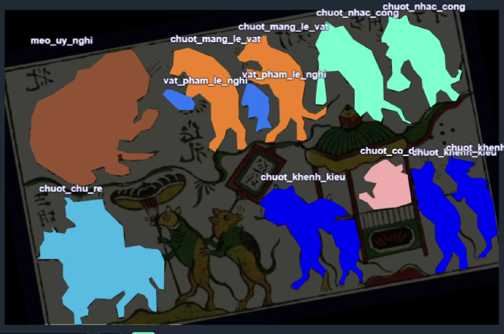
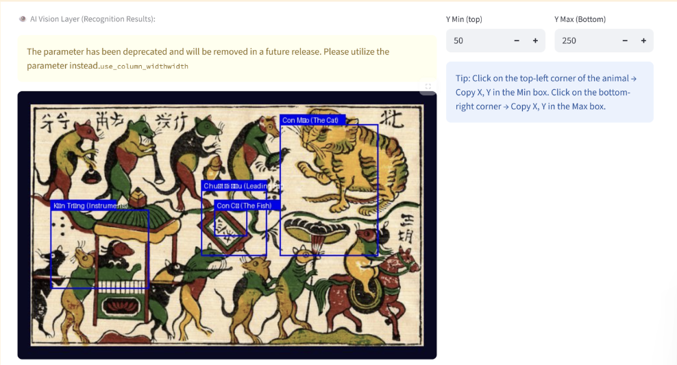
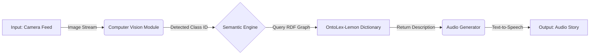

# 🎨 Tactile Audio: Touching the Soul of Dong Ho Folk Paintings

`https://img.shields.io/badge/Powered%20by-Roboflow-purple` ](https://roboflow.com)
`https://img.shields.io/badge/Data-OntoLex--Lemon-yellow` ](https://www.w3.org/2016/05/ontolex/)
`https://img.shields.io/badge/Made%20with-Python-blue` ]( `https://www.python.org/)`

> **"Art should not be just for the eyes. It should be for the hands, the ears, and the heart."**

## 📖 Introduction

### 🏮 Cultural Context: The UNESCO Urgency

**Dong Ho Folk Painting**, a centuries-old Vietnamese woodblock art, is currently a candidate for **UNESCO's List of Intangible Cultural Heritage in Need of Urgent Safeguarding**.


**Tactile Audio** is an accessibility project designed to bridge the gap between Vietnamese Cultural Heritage (**Dong Ho Folk Paintings**) and the **Visually Impaired community**.

By integrating **Computer Vision (YOLO/Roboflow)** with **Semantic Web technologies (OntoLex-Lemon)**, this system allows blind users to "hear" the stories hidden within the woodblock prints just by touching them.

---



> *The AI will identify motifs (e.g., 'The Groom', 'The Bride') in the 'Mouse Wedding' painting in real-time.*

---

## 🧩 The Problem & Solution

| The Problem | The Solution |
| :--- | :--- |
| **Invisible Heritage:** Visually impaired people cannot experience the visual beauty of Dong Ho paintings. | **Tactile Interface:** A 3D-printed frame mimics the woodblock texture for users to touch. |
| **Lack of Context:** Traditional audio guides only describe the whole picture, not specific details. | **AI-Driven Context:** Computer Vision identifies exactly *where* the user is touching to trigger specific audio stories. |
| **Data Silos:** Cultural data is often unstructured text, hard for machines to process. | **Structured Knowledge:** Using **OntoLex-Lemon** to model the cultural semantics of each motif. |

---

## 🛠️ System Architecture

The project pipeline consists of three main modules:


Vision Layer: Uses a custom-trained model on Roboflow to detect specific folk motifs (e.g., Chicken, Lotus, Toad).

Semantic Layer: Maps the detected ID to a Knowledge Graph constructed with OntoLex-Lemon, ensuring rich cultural context (lexical entries, senses, and usage).

Interaction Layer: Converts the retrieved semantic data into audio feedback.

💻 Tech Stack
Core Language: Python 3.9+

Computer Vision: Roboflow (Training), OpenCV (Inference)

Knowledge Graph: Protégé (Editor), RDFLib (Parsing), OntoLex-Lemon (Standard)

Hardware (Prototype): Webcam, Tactile Frame (3D Printed PLA)

📂 Project Structure

```bash
├── DHtactic_au
│   ├── dong_ho_dataset.csv/     # .owl and .ttl files (OntoLex models)
│   ├── DHtactic_au/app.py       # Application entry point
│   └── tDHimg/                  # Training images for Roboflow
└── README.md
```
🧐 Why OntoLex-Lemon?
Unlike standard image classification which returns a simple label (e.g., "cat"), this project needs to convey cultural meaning.

Label: "Con Gà" (Chicken)

OntoLex Sense: Symbol of prosperity, five virtues, dawn bringer.

By using OntoLex, we create a Machine-Readable Dictionary of folk art that can be expanded to other languages and cultures.

👩‍💻 About the Author
Le Huyen Anh - Big Data Student & Cultural Heritage Enthusiast

Focus: Bridging the gap between Advanced Tech (AI/Data) and Humanistic Values.

Vision: To digitally preserve endangered folk arts and make them accessible to everyone.